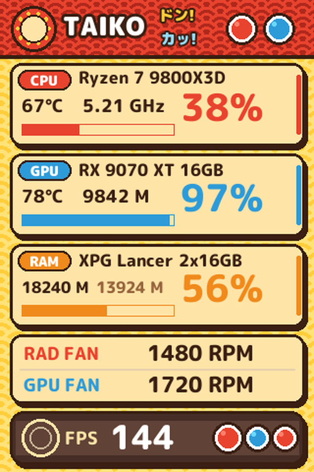

# 🥁 taiko-smart-screen-theme

Tema colorido inspirado em **Taiko no Tatsujin** para telinhas USB de 3,5" (Turing Smart Screen / XuanFang), feito para o [turing-smart-screen-python](https://github.com/mathoudebine/turing-smart-screen-python), com leitura de sensores direto do **HWiNFO**.

<p align="center"></p>

> Tema de fã, com desenho **original** feito por código: usa só a paleta e o clima do jogo (notas *don* vermelhas e *ka* azuis, estampa de ondas, pista de notas). Não contém personagens, logos nem nenhum asset da Bandai Namco.

## O que mostra

| Painel | Leituras |
|---|---|
| **CPU** (vermelho, *don*) | temperatura (Tctl/Tdie), clock médio dos núcleos, uso % e gráfico |
| **GPU** (azul, *ka*) | temperatura de **hot spot**, VRAM usada, uso % e gráfico |
| **RAM** (laranja) | usada, livre, uso % e gráfico |
| **Ventoinhas** | radiador (conector CPU_FAN) e GPU em **RPM** |
| **Pista de notas** | **FPS médio** (~10 s) vindo do RTSS |

Tudo atualiza a cada 2 s, para não sobrecarregar a porta serial das telinhas revisão A (que corrompem a imagem com tráfego demais).

## Estrutura

```
taiko-luis/                 o tema (vai em res/themes/)
  theme.yaml
  background.png
  gerar_fundo.py            gera o background.png (cores e layout ficam aqui)
fonts/mplus-rounded/        M PLUS Rounded 1c ExtraBold/Black + licença OFL (vai em res/fonts/)
sensors/                    vão em library/sensors/
  sensors_hwinfo.py         leitor de sensores pelo Gadget do HWiNFO (sem admin)
  sensors_custom.py         sensores extras: CPU_FAN_RPM, GPU_FAN_RPM, GPU_HOTSPOT
preview.png
```

## Instalação

1. Copie `taiko-luis/` para `res/themes/` e `fonts/mplus-rounded/` para `res/fonts/` do turing-smart-screen-python.
2. Copie os dois arquivos de `sensors/` para `library/sensors/`.
3. Em `library/stats.py`, adicione o leitor novo junto dos outros (antes do `elif HW_SENSORS == "STUB":`):

   ```python
   elif HW_SENSORS == "HWINFO":
       if platform.system() == 'Windows':
           import library.sensors.sensors_hwinfo as sensors
       else:
           logger.error("HWiNFO integration is only available on Windows")
           try:
               sys.exit(0)
           except:
               os._exit(0)
   ```

4. No `config.yaml`:

   ```yaml
   THEME: taiko-luis
   HW_SENSORS: HWINFO
   ```

5. No **HWiNFO** (rodando em segundo plano, modo *Sensors-only*), em *Configurar sensores → HWiNFO Gadget*, marque **"Habilitar relatórios para o Gadget"** e ative **"Report value in Gadget"** só nestas leituras, nesta ordem de índice (`VSBidx`):

   | Índice | Leitura |
   |---|---|
   | 0 | CPU (Tctl/Tdie) |
   | 1 | GPU Temperature |
   | 2 | GPU Hot Spot Temperature |
   | 3 | GPU Utilization |
   | 4 | GPU D3D Memory Dedicated |
   | 5 | GPU Fan PWM |
   | 6 | Average Effective Clock (CPU) |
   | 7 | Ventoinha CPU da placa-mãe (RPM) |
   | 8 | RTSS → Framerate |
   | 9 | GPU Fan (RPM) |

   Se a sua ordem for diferente, ajuste o `VSB_INDEX` no topo de `sensors_hwinfo.py`. Uso de CPU, RAM, VRAM usada e clock da CPU vêm do próprio Windows (psutil / contadores PDH), sem tocar no hardware.

## Ajustes

- **Cores e desenho do fundo:** edite `gerar_fundo.py` e rode `python taiko-luis/gerar_fundo.py` (com Pillow instalado). Dentro do projeto o script acha a fonte em `res/fonts/`; aqui no repositório ela está em `fonts/`.
- **Posições e tamanhos dos textos:** `theme.yaml`. Os textos usam âncora `lt` (topo das letras no Y); para centralizar numa altura `cy`, use `Y = cy - altura_do_texto / 2`.
- **Nomes dos componentes:** `static_text` → `CPU_MODEL`, `GPU_MODEL`, `RAM_MODEL`.

## Créditos

- **Ideia e direção:** [LuisFellp](https://github.com/LuisFellp), a partir de um pedido vago e uma telinha que precisava de um tema colorido.
- **Design, arte gerada por código, tema e leitor do HWiNFO:** feitos pelo **Claude** (Anthropic), no Claude Code.
- **Base:** [turing-smart-screen-python](https://github.com/mathoudebine/turing-smart-screen-python), de Matthieu Houdebine, sob GPL-3.0. Os arquivos em `sensors/` derivam dele.
- **Fonte:** [M PLUS Rounded 1c](https://fonts.google.com/specimen/M+PLUS+Rounded+1c), © The Rounded M+ Project Authors, sob SIL Open Font License 1.1 (`fonts/mplus-rounded/OFL.txt`).
- **Inspiração:** Taiko no Tatsujin © Bandai Namco Entertainment. Este é um projeto de fã, sem afiliação.

## Licença

Código e tema sob **GPL-3.0** (veja `LICENSE`), compatível com o projeto base. A fonte segue a **OFL 1.1**.
